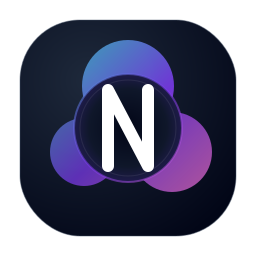

<div align="center">



# Nexus

**Full-stack framework** — islands-first HTML, **Svelte 5** runes on the client, **server actions**, file-based routes, and streaming SSR.

[](https://opensource.org/licenses/MIT)
[](https://www.typescriptlang.org/)
[](https://pnpm.io/)
[](https://nodejs.org/)

[Website — nexusjs.dev](https://nexusjs.dev) · [Docs in this repo](./docs/README.md) · [Contributing](./CONTRIBUTING.md) · [Changelog](./CHANGELOG.md)

</div>

---

## Overview

Nexus targets **minimal JavaScript by default**: most of the page is static HTML from the server; only subtrees marked with **`client:*`** hydrate in the browser. Interactive regions use **Svelte 5 runes** (`$state`, `$derived`, `$effect`, …). Server-side logic uses a **`---`** frontmatter block in `.nx` files, plus typed **server actions** and optional **pretext** loaders for route data.

End-user documentation and tutorials live on **[nexusjs.dev](https://nexusjs.dev)**. This repository holds the **implementation** (`packages/`), **examples**, and **contributor docs** under [`docs/`](./docs/README.md).

---

## Quick start

**Requirements:** Node.js **≥ 22**, **pnpm ≥ 9** (use **`.nvmrc`** with `nvm use` / `fnm use`; this monorepo uses `workspace:` links — run **`pnpm install`** at the root).

**New application** (published CLI):

```bash
npm exec --package=@nexus_js/cli@latest -- create-nexus my-app
cd my-app
npm install
npm run dev
```

Other entrypoints (e.g. `pnpm create @nexus_js/nexus`, global installs) are described in [`packages/create-nexus/README.md`](./packages/create-nexus/README.md).

**Clone this repo** (framework development):

```bash
git clone https://github.com/<org>/nexus.git
cd nexus
nvm use   # Node 22 — see .nvmrc (or fnm use / mise use)
pnpm install
pnpm build
pnpm test
```

Run the minimal example: `pnpm example` (starts the `basic` example). Other examples: `pnpm dev:pokedex`, `pnpm dev:nexusflow`, etc.

---

## Monorepo layout

Published npm packages live under **`packages/`**. **`examples/`** are sample apps included in the workspace; they are not published as framework packages.

```
nexus/
├── packages/
│   ├── compiler/          # .nx → JS (parser, codegen, islands, CSS scoping)
│   ├── runtime/           # Client: runes, islands, navigation, cache, store
│   ├── server/            # HTTP server, SSR, streaming, actions
│   ├── router/            # File-based route manifest
│   ├── cli/               # `nexus` CLI and Nexus Studio
│   ├── create-nexus/      # `npm create @nexus_js/nexus` scaffold
│   ├── head/              # Metadata (defineHead / useHead)
│   ├── serialize/         # Types across server ↔ client boundaries
│   ├── vite-plugin-nexus/ # Vite integration
│   ├── assets/            # Image / font pipeline
│   ├── db/                # Optional DB helper (BYO client)
│   ├── middleware/, connect/, security/, sync/, audit/
│   ├── types/, testing/, ui/
│   └── nexus_js / nexus-js   # Meta-packages re-exporting the stack
├── examples/              # Demos: basic, pokedex, nexusflow, …
├── docs/                  # Contributor docs + [REPOSITORY.md](./docs/REPOSITORY.md) (clean GitHub publish)
└── .github/workflows/     # CI
```

Maintainers: release process is documented in [`docs/PUBLISHING.md`](./docs/PUBLISHING.md).

---

## The `.nx` format (short)

Each file can include:

1. **`---` frontmatter** — server-only: imports, data loading, `// nexus:pretext`, actions.
2. **`<script>`** — Svelte 5 runes for island code.
3. **`<template>`** — HTML with `{expressions}` and `{#if}` / `{#each}`.
4. **`<style>`** — scoped CSS.

Hydration examples: `client:load`, `client:idle`, `client:visible`, `client:media="…"`, `server:only`. Details: [`docs/ISLANDS.md`](./docs/ISLANDS.md), [`docs/PRETEXT.md`](./docs/PRETEXT.md).

---

## Feature snapshot

| Area | Highlights |
|------|------------|
| Rendering | Islands, streaming SSR, automatic cache-related `Cache-Control` hints |
| Data | Pretext merged into `$pretext()`, `cache()` with tags/TTL |
| Client | Global store, optimistic updates, SPA-style navigation where enabled |
| Tooling | `nexus dev | build | start | check | studio`, bundle analysis |

---

## Contributing

Issues and pull requests are welcome. See [**CONTRIBUTING.md**](./CONTRIBUTING.md) (setup, structure, commits, tests). To **replace or recreate the GitHub remote** with a clean tree only, follow [**docs/REPOSITORY.md**](./docs/REPOSITORY.md).

---

## License

MIT — see [LICENSE](./LICENSE).
