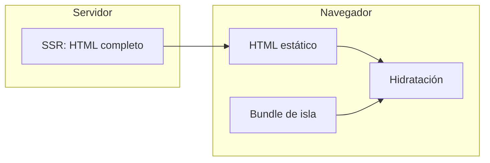

# Islas y componentes `.nx` (Nexus)

Guía breve para equipos: cómo encaja el modelo **HTML primero + islas hidratadas** y cómo **organizar componentes**.

## Idea en una frase

La página se renderiza en el **servidor** como HTML estático. Solo los fragmentos marcados con **`client:*`** descargan JavaScript y se **hidratan** en el navegador (runes, eventos, reactividad).

## Directivas de hidratación

| Directiva | Cuándo carga JS | Uso típico |
|-----------|-----------------|------------|
| `client:load` | Al cargar la página | UI crítica (nav, modal) |
| `client:idle` | Cuando el navegador está idle | Widgets secundarios |
| `client:visible` | Al entrar en el viewport | Contenido bajo el fold |
| `client:media="(max-width: …)"` | Si coincide la media query | Solo móvil / solo desktop |
| `server:only` | Nunca | Tablas pesadas, admin sin JS |

## Bloques de un archivo `.nx`

1. **`---` frontmatter** — solo servidor: datos, `import`, `await`.
2. **`<script>`** — runes (`$state`, `$derived`, `$effect`) para lo que vive en la isla.
3. **Plantilla** — HTML con `{expresiones}` y directivas `client:*` en el nodo raíz del trozo interactivo.
4. **`<style>`** — CSS con alcance al archivo.

## Componentizar (organizar el código)

- **Rutas**: `src/routes/.../+page.nx`, `+layout.nx`.
- **Componentes reutilizables**: `src/components/Nombre.nx` (o junto a la ruta).
- **Imports**: en el frontmatter, p. ej. `import MiCard from '../components/MiCard.nx'` (resolución según el compilador y alias `$lib`).
- **Convención**: un `.nx` por componente; la **interactividad** se concentra en el subárbol marcado con `client:*`.

Para precisión de imports y árbol de componentes, ver también el código en [`packages/compiler/src/preload-scanner.ts`](../packages/compiler/src/preload-scanner.ts) (resolución de `.nx` y preloads).

## Idioma (i18n) en la app de ejemplo

En `my-nexus-app`, el idioma activo sigue `?lang=` / `?locale=` (p. ej. `?lang=es`), la cookie `nx-lang` y `Accept-Language`; el listado coincide con `i18n.locales` en `nexus.config.ts`. Las rutas internas enlazan con `pathWithLang` para conservar el idioma.

## Más documentación

- Sitio: [nexusjs.dev](https://nexusjs.dev)
- App de ejemplo en el monorepo: `my-nexus-app/src/routes/islands/+page.nx`
